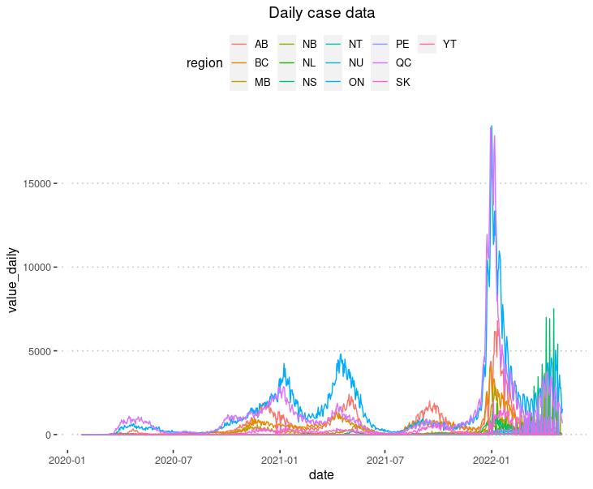
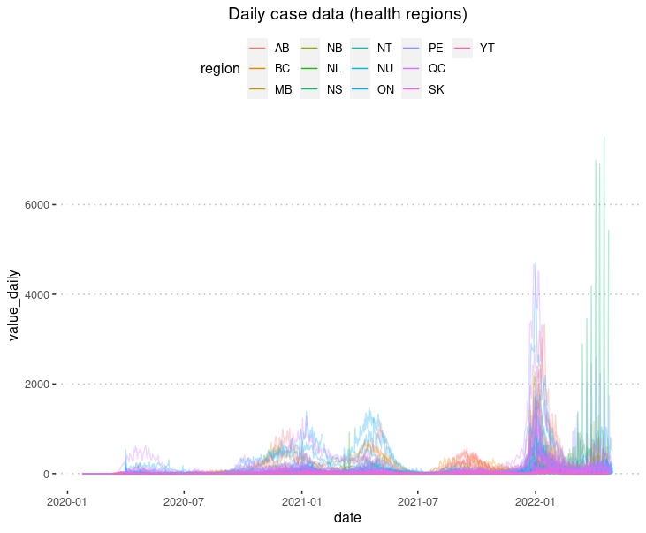
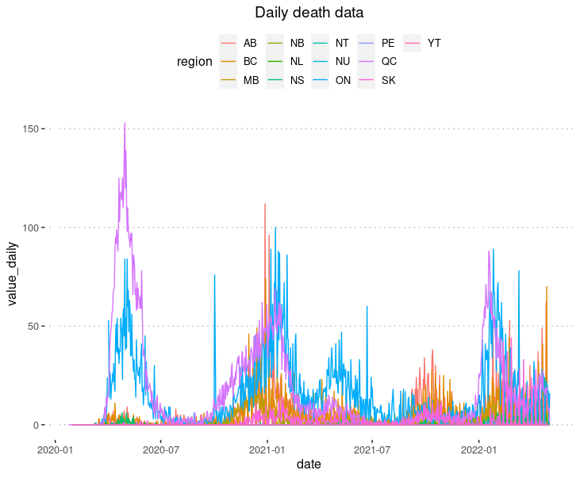
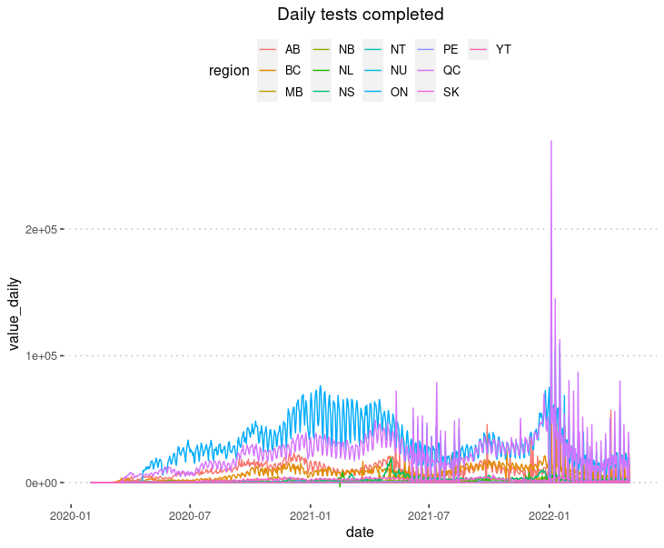
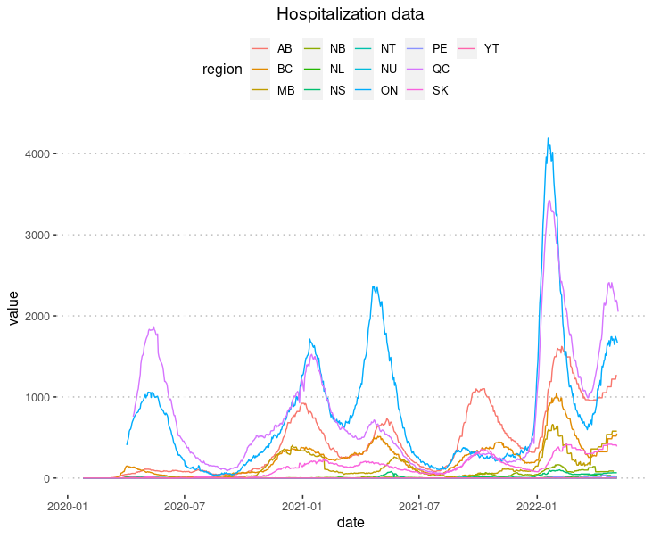
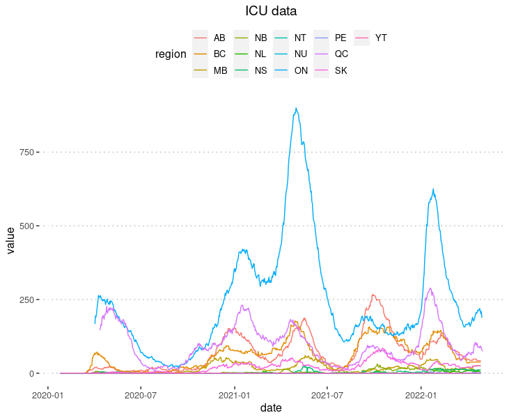

# Timeline of COVID-19 in Canada

The purpose of this repository is to collaborate on assembling a definitive dataset for COVID-19 in Canada.

⚠️ Beginning April 30, this dataset replaced the original **[Covid19Canada](https://github.com/ccodwg/Covid19Canada)** dataset. ⚠️

🚨 Coming soon: [vaccine coverage](https://github.com/ccodwg/CovidTimelineCanada/issues/21), [vaccine distribution](https://github.com/ccodwg/CovidTimelineCanada/issues/22), ["diffs" datasets](https://github.com/ccodwg/CovidTimelineCanada/issues/20) to show changes since the last time a jurisdiction received a data update 🚨

This dataset is one component of the **[What Happened? COVID-19 in Canada](https://whathappened.coronavirus.icu/)** project. The goal is for this dataset to eventually conform to the [Data and Metadata Standard for COVID-19 Data in Canada](https://github.com/ccodwg/CovidDataStandard), which is currently being collaboratively developed.

## Contributing

To contribute to this project, please refer to the ongoing discussions in the issues board or open up a new one. We need help identifying the best data sources for each value and harmonizing them into a single dataset. Please add new data sources to the [wiki page](https://github.com/ccodwg/CovidTimelineCanada/wiki/List-of-data-sources).

We must also identify gaps in publicly available data. These data may then be requested from the relevant agencies or acquired via Access to Information requests (see [an example with Sasksatchewan's COVID-19 data](https://data.gripe/covid-19-in-saskatchewan/)).

## How to download these data

To download all the datasets in this repository, click the big green "Code" button, then click "Download ZIP". Save it to the location of your choice and unzip the contents. All of the CSV files containing the data can be opened using your spreadsheet software or statistical package of choice.

More advanced queries are available via our JSON API: [https://api.opencovid.ca/](https://api.opencovid.ca/).

## Data format

- name: The name of the metric (e.g., cases, testing)
- province: The two-letter code for the province or territory (e.g., ON, AB)
- sub_region_1: The unique identifier of the health region (e.g., 3595, 594) (this column is absent for PT-level data)
- sub_region_2: The name of the sub-region (e.g., Downtown, Yellowknife) (this column is absent for PT and HR-level data)
- date: The date in YYYY-MM-DD format
- value: The cumulative value (e.g., cumulative number of cases, number of active hospitalizations)
- value_daily: The daily value (e.g., daily number of cases, change in the number of active hospitalizations)

## How data updates work

The data in this repository are updated using a variety of scripts present in the repository. At present, this process relies on the following R packages:

* [Covid19CanadaData](https://github.com/ccodwg/Covid19CanadaData): Loads the live version of a specified public dataset (denoted by its UUID in [dataset.json](https://github.com/ccodwg/Covid19CanadaArchive/blob/master/datasets.json)) using the function Covid19CanadaData::dl_dataset
* [Covid19CanadaDataProcess](https://github.com/ccodwg/Covid19CanadaDataProcess): Processes a given dataset into a standardized data format
* [Covid19CanadaDataETL](https://github.com/ccodwg/Covid19CanadaETL): The ETL (extract-load-transform) package coordinates downloading, processing and writing the final combined datasets

## Included datasets

The following datasets are included in this repository:

* Cases by province/territory (`cases_pt.csv`) and health region (`cases_hr.csv`)

* Deaths by province/territory (`deaths_pt.csv`) and health region (`deaths_hr.csv`)

* Tests completed by province/territory (`tests_completed_pt.csv`)

* Hospitalizations (non-ICU and ICU) by province/territory (`hospitalizations_pt.csv`)

* ICU occupancy by province (`icu_pt.csv`)

Both the cumulative values (`value`) and the daily differences (`value_daily`) are given for each date where data are available.

## Detailed description of data sources

### Cases

**List will be updated shortly**

### Deaths

**List will be updated shortly**

### Hospitalizations

**List will be updated shortly**

### ICU

**List will be updated shortly**

### Tests completed

All data on completed COVID-19 tests are from the [Public Health Agency of Canada](https://health-infobase.canada.ca/covid-19/epidemiological-summary-covid-19-cases.html).

### Vaccine coverage

**Coming soon!**

### Vaccine distribution

**Coming soon!**
