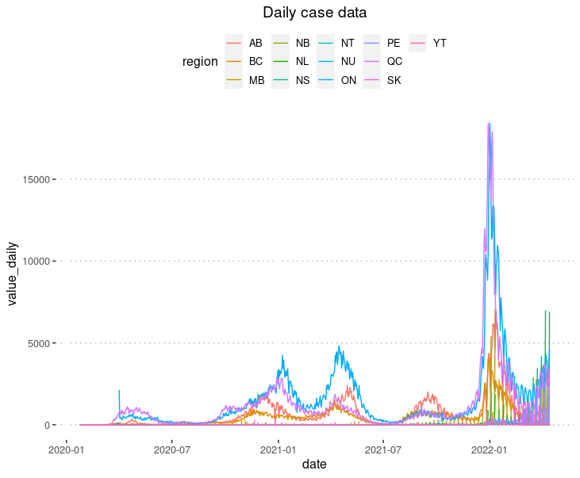
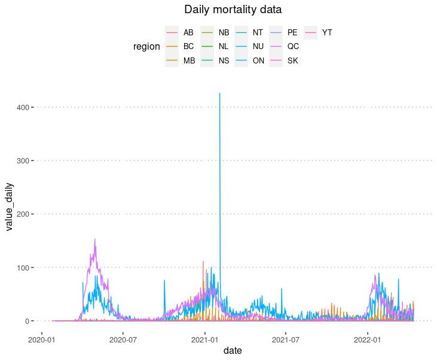
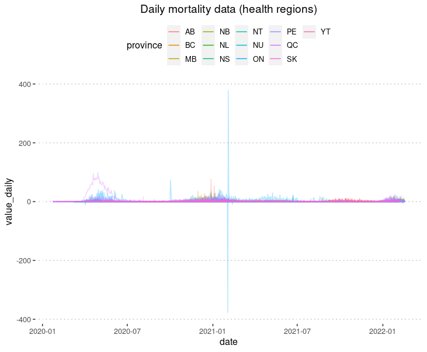
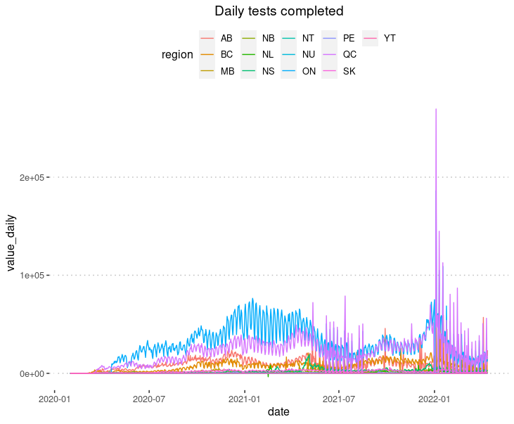
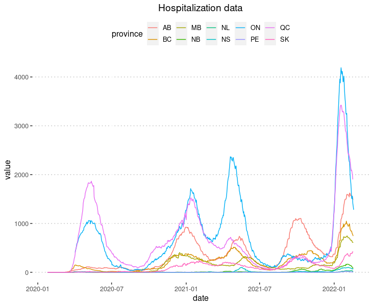
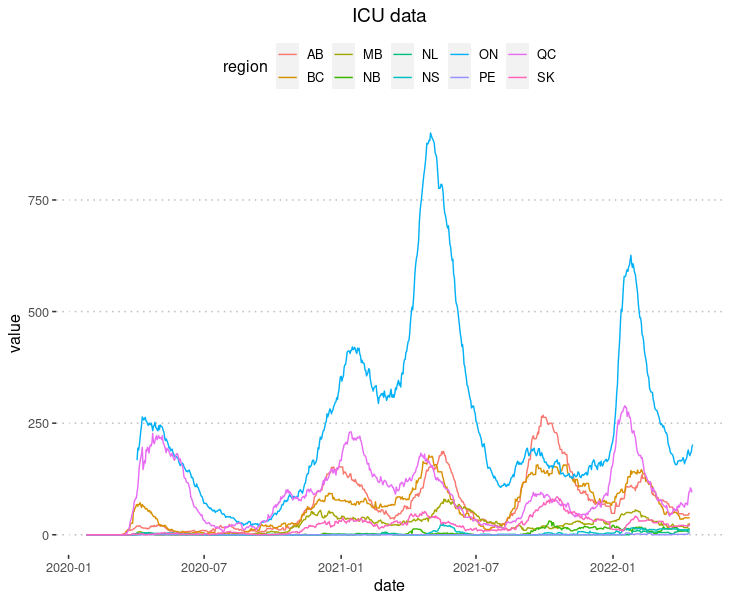

# Timeline of COVID-19 in Canada

The purpose of this repository is to collaborate on assembling a definitive dataset for COVID-19 in Canada.

⚠️ This dataset is in the process of being updated in advance of its official launch on April 30. The format of the dataset may change prior to this date. Beginning April 30, this dataset will replace the original **[Covid19Canada](https://github.com/ccodwg/Covid19Canada)** dataset. ⚠️

This dataset is one component of the **[What Happened? COVID-19 in Canada](https://whathappened.coronavirus.icu/)** project. The goal is for this dataset to eventually conform to the [Data and Metadata Standard for COVID-19 Data in Canada](https://github.com/ccodwg/CovidDataStandard), which is currently being collaboratively developed.

## Contributing

To contribute to this project, please refer to the ongoing discussions in the issues board or open up a new one. We need help identifying the best data sources for each value and harmonizing them into a single dataset. Please add new data sources to the [wiki page](https://github.com/ccodwg/CovidTimelineCanada/wiki/List-of-data-sources).

We must also identify gaps in publicly available data. These data may then be requested from the relevant agencies or acquired via Access to Information requests (see [an example with Sasksatchewan's COVID-19 data](https://data.gripe/covid-19-in-saskatchewan/)).

## How to download these data

To download all the datasets in this repository, click the big green "Code" button, then click "Download ZIP". Save it to the location of your choice and unzip the contents. All of the CSV files containing the data can be opened using your spreadsheet software or statistical package of choice.

## Data format

**Note: This data format is very likely to change.**

- name: The name of the metric (e.g., cases, testing)
- province: The two-letter code for the province or territory (e.g., ON, AB)
- sub_region_1: The health region (for provincial-level data, this column is absent)
- date: The date in YYYY-MM-DD format
- value: The cumulative value (e.g., cumulative number of cases, cumulative number of tests)
- value_daily: The daily value (e.g., daily number of cases, daily number of tests)

## How data updates work

The data in this repository may be updated using the script `scripts/update_data.R`. At present, this process relies on the following R packages:

* [Covid19CanadaData](https://github.com/ccodwg/Covid19CanadaData): Loads the live version of a specified public dataset (denoted by its UUID in [dataset.json](https://github.com/ccodwg/Covid19CanadaArchive/blob/master/datasets.json)) using the function Covid19CanadaData::dl_dataset
* [Covid19CanadaDataProcess](https://github.com/ccodwg/Covid19CanadaDataProcess): Processes a given dataset into a standardized data format
* [Covid19CanadaDataETL](https://github.com/ccodwg/Covid19CanadaETL): The ETL (extract-load-transform) package coordinates downloading, processing and writing the final combined datasets

## Included datasets

The following datasets are included in this repository:

* Cases by province (`cases_prov.csv`) and health region (`cases_hr.csv`)

* Mortality by province (`mortality_prov.csv`) and health region (`mortality_hr.csv`)

* Tests completed by province (`tests_completed_prov.csv`)

* Hospitalizations (ICU and non-ICU) by province (`hosp_prov.csv`)

* ICU occupancy by province (`icu_prov.csv`)

Both the cumulative values (`value`) and the daily differences (`value_daily`) are given for each date where data are available.

## Detailed description of data sources

### Cases & mortality

| Province/territory | Data sources                                                                                                                                                                                                                 |
|--------------------|------------------------------------------------------------------------------------------------------------------------------------------------------------------------------------------------------------------------------|
| AB                 | - [Government of Alberta](https://www.alberta.ca/stats/covid-19-alberta-statistics.htm) (cases) - [COVID-19 Canada Open Data Working Group](https://opencovid.ca/) (deaths)                                               |
| BC                 | - [Government of British Columbia](http://www.bccdc.ca/health-info/diseases-conditions/covid-19/data) (cases) - [COVID-19 Canada Open Data Working Group](https://opencovid.ca/) (deaths)                                         |
| MB                 | - [COVID-19 Canada Open Data Working Group](https://opencovid.ca/)                                                                                                                                                           |
| NB                 | - [COVID-19 Canada Open Data Working Group](https://opencovid.ca/)                                                                                                                                                           |
| NL                 | - [COVID-19 Canada Open Data Working Group](https://opencovid.ca/)                                                                                                                                                           |
| NS                 | - [COVID-19 Canada Open Data Working Group](https://opencovid.ca/)                                                                                                                                                           |
| NT                 | - [Public Health Agency of Canada](https://health-infobase.canada.ca/covid-19/epidemiological-summary-covid-19-cases.html)                                                                                                   |
| NU                 | - [Public Health Agency of Canada](https://health-infobase.canada.ca/covid-19/epidemiological-summary-covid-19-cases.html)                                                                                                   |
| ON                 | - [Government of Ontario](https://data.ontario.ca/dataset/status-of-covid-19-cases-in-ontario-by-public-health-unit-phu)                                                                                                     |
| PE                 | - [Public Health Agency of Canada](https://health-infobase.canada.ca/covid-19/epidemiological-summary-covid-19-cases.html)                                                                                                   |
| QC                 | - [Institut Nationale De Santé Publique Du Québec](https://www.inspq.qc.ca/covid-19/donnees)                                                                                                                                 |
| SK                 | - [Government of Saskatchewan](https://dashboard.saskatchewan.ca/health-wellness/covid-19/cases) (August 4, 2020 and onward) - [Jean-Paul R. Soucy](https://data.gripe/covid-19-in-saskatchewan/) (before August 4, 2020) |
| YT                 | - [Public Health Agency of Canada](https://health-infobase.canada.ca/covid-19/epidemiological-summary-covid-19-cases.html)                                                                                                   |

### Hospitalizations & ICU

| Province/territory | Data sources                                                                                                                                                                                                 |
|--------------------|--------------------------------------------------------------------------------------------------------------------------------------------------------------------------------------------------------------|
| AB                 | - [COVID-19 Tracker Canada](https://covid19tracker.ca)                                                                                                                                                       |
| BC                 | - [COVID-19 Tracker Canada](https://covid19tracker.ca)                                                                                                                                                       |
| MB                 | - [COVID-19 Tracker Canada](https://covid19tracker.ca)                                                                                                                                                       |
| NB                 | - [COVID-19 Tracker Canada](https://covid19tracker.ca)                                                                                                                                                       |
| NL                 | - [COVID-19 Tracker Canada](https://covid19tracker.ca)                                                                                                                                                       |
| NS                 | - [COVID-19 Tracker Canada](https://covid19tracker.ca)                                                                                                                                                       |
| NT                 | - These data are not reported by the territory                                                                                                                                                               |
| NU                 | - These data are not reported by the territory                                                                                                                                                               |
| ON                 | - [Government of Ontario](https://data.ontario.ca/dataset/covid-19-cases-in-hospital-and-icu-by-ontario-health-region)                                                                                       |
| PE                 | - [COVID-19 Tracker Canada](https://covid19tracker.ca)                                                                                                                                                       |
| QC                 | - [Institut Nationale De Santé Publique Du Québec](https://www.inspq.qc.ca/covid-19/donnees) (April 10, 2020 and beyond) - [COVID-19 Tracker Canada](https://covid19tracker.ca) (prior to April 10, 2020) |
| SK                 | - [COVID-19 Tracker Canada](https://covid19tracker.ca)                                                                                                                                                       |
| YT                 | - These data are not reported by the territory                                                                                                                                                               |

### Tests completed

All data on completed COVID-19 tests are from the [Public Health Agency of Canada](https://health-infobase.canada.ca/covid-19/epidemiological-summary-covid-19-cases.html).
